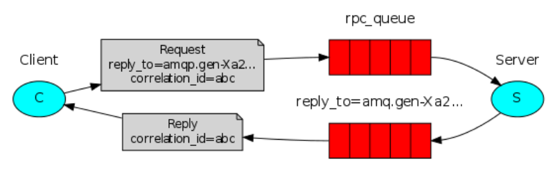

### RabbitMQ 实现 RPC
关于 RabbitMQ 实现 RPC 调用，有的小伙伴可能会有一些误解，心想这还不简单？搞两个消息队列 queue_1 和 queue_2，首先客户端发送消息到 queue_1 上，
服务端监听 queue_1 上的消息，收到之后进行处理；处理完成后，服务端发送消息到 queue_2 队列上，然后客户端监听 queue_2 队列上的消息，这样就知道服务端的处理结果了。  

这种方式不是不可以，就是有点麻烦！RabbitMQ 中提供了现成的方案可以直接使用，非常方便。  

 
这张图把问题说的很明白了：

1. 首先 Client 发送一条消息，和普通的消息相比，这条消息多了两个关键内容：
**一个是 correlation_id，这个表示这条消息的唯一 id，还有一个内容是 reply_to，这个表示消息回复队列的名字**。
2. Server 从消息发送队列获取消息并处理相应的业务逻辑，处理完成后，将处理结果发送到 reply_to 指定的回调队列中。
3. Client 从回调队列中读取消息，就可以知道消息的执行情况是什么样子了。
