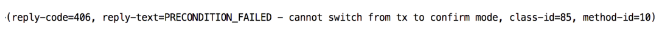
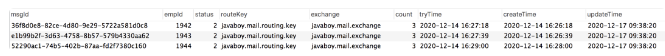

确保消息发送的可靠性，主要从两方面去确认：  
1 **消息成功到达 Exchange**  
2 **消息成功到达 Queue**  
如果这两步中任一步骤出现问题，那么消息就没有成功送达，此时我们可能要通过重试等方式去重新发送消息，多次重试之后，如果消息还是不能到达，则可能就需要人工介入了。  

确保消息发送成功，需要做好三件事：  
1 **确认消息到达 Exchange**。  
2 **确认消息到达 Queue**。  
3 **开启定时任务，定时投递那些发送失败的消息**。  
##### 如何确保消息成功到达 RabbitMQ？RabbitMQ 给出了两种方案：  
1 **开启事务机制**  
2 **发送方确认机制**  
这是两种不同的方案，不可以同时开启，只能选择其中之一，如果两者同时开启，则会报如下错误：
  

#### 失败重试
##### 自带重试机制
```properties
# 自带重试机制
# 如果发送方一开始就连不上 MQ，那么 Spring Boot 中也有相应的重试机制，但是这个重试机制就和 MQ 本身没有关系了，这是利用 Spring 中的 retry 机制来完成的
spring.rabbitmq.template.retry.enabled=true
# 重试起始间隔时间
spring.rabbitmq.template.retry.initial-interval=1000ms
# 最大重试次数
spring.rabbitmq.template.retry.max-attempts=6
# 间隔时间乘数
spring.rabbitmq.template.retry.multiplier=1.2
# 最大重试间隔时间
spring.rabbitmq.listener.direct.retry.max-interval=10000ms
```
输出：
```text
2023-03-14 12:20:00.206 ERROR 3760 --- [93.160.246:5672] o.s.a.r.c.CachingConnectionFactory       : Shutdown Signal: channel error; protocol method: #method<channel.close>(reply-code=406, reply-text=PRECONDITION_FAILED - inequivalent arg 'x-message-ttl' for queue 'javaboy_queue_name' in vhost '/': received none but current is the value '10000' of type 'signedint', class-id=50, method-id=10)
2023-03-14 12:20:01.247 ERROR 3760 --- [93.160.246:5672] o.s.a.r.c.CachingConnectionFactory       : Shutdown Signal: channel error; protocol method: #method<channel.close>(reply-code=406, reply-text=PRECONDITION_FAILED - inequivalent arg 'x-message-ttl' for queue 'javaboy_queue_name' in vhost '/': received none but current is the value '10000' of type 'signedint', class-id=50, method-id=10)
2023-03-14 12:20:03.282 ERROR 3760 --- [93.160.246:5672] o.s.a.r.c.CachingConnectionFactory       : Shutdown Signal: channel error; protocol method: #method<channel.close>(reply-code=406, reply-text=PRECONDITION_FAILED - inequivalent arg 'x-message-ttl' for queue 'javaboy_queue_name' in vhost '/': received none but current is the value '10000' of type 'signedint', class-id=50, method-id=10)
2023-03-14 12:20:07.307 ERROR 3760 --- [93.160.246:5672] o.s.a.r.c.CachingConnectionFactory       : Shutdown Signal: channel error; protocol method: #method<channel.close>(reply-code=406, reply-text=PRECONDITION_FAILED - inequivalent arg 'x-message-ttl' for queue 'javaboy_queue_name' in vhost '/': received none but current is the value '10000' of type 'signedint', class-id=50, method-id=10)
2023-03-14 12:20:12.336 ERROR 3760 --- [93.160.246:5672] o.s.a.r.c.CachingConnectionFactory       : Shutdown Signal: channel error; protocol method: #method<channel.close>(reply-code=406, reply-text=PRECONDITION_FAILED - inequivalent arg 'x-message-ttl' for queue 'javaboy_queue_name' in vhost '/': received none but current is the value '10000' of type 'signedint', class-id=50, method-id=10)
2023-03-14 12:20:13.365 ERROR 3760 --- [93.160.246:5672] o.s.a.r.c.CachingConnectionFactory       : Shutdown Signal: channel error; protocol method: #method<channel.close>(reply-code=404, reply-text=NOT_FOUND - no exchange 'RabbitConfig.JAVABOY_EXCHANGE_NAME' in vhost '/', class-id=60, method-id=40)
```
#### 业务重试
业务重试主要是针对消息没有到达交换器的情况。  
如果消息没有成功到达交换器，根据我们第二小节的讲解，此时就会触发消息发送失败回调，在这个回调中，我们就可以做文章了！   
思路：  
1 首先创建一张表，用来记录发送到中间件上的消息，像下面这样：
  
每次发送消息的时候，就往数据库中添加一条记录。这里的字段都很好理解，有三个我额外说下：
- status：表示消息的状态，有三个取值，0，1，2 分别表示消息发送中、消息发送成功以及消息发送失败。
- tryTime：表示消息的第一次重试时间（消息发出去之后，在 tryTime 这个时间点还未显示发送成功，此时就可以开始重试了）。
- count：表示消息重试次数。
2 在消息发送的时候，我们就往该表中保存一条消息发送记录，并设置状态 status 为 0，tryTime 为 1 分钟之后。  
3 在 confirm 回调方法中，如果收到消息发送成功的回调，就将该条消息的 status 设置为1（在消息发送时为消息设置 msgId，在消息发送成功回调时，通过 msgId 来唯一锁定该条消息）。  
4 另外开启一个定时任务，定时任务每隔 10s 就去数据库中捞一次消息，专门去捞那些 status 为 0 并且已经过了 tryTime 时间记录，把这些消息拎出来后，首先判断其重试次数是否已超过 3 次，如果超过 3 次，则修改该条消息的 status 为 2，表示这条消息发送失败，并且不再重试。对于重试次数没有超过 3 次的记录，则重新去发送消息，并且为其 count 的值+1。  

当然这种思路有两个弊端：

1 去数据库走一遭，可能拖慢 MQ 的 Qos，不过有的时候我们并不需要 MQ 有很高的 Qos，所以这个应用时要看具体情况。  
2 按照上面的思路，可能会出现同一条消息重复发送的情况，不过这都不是事，我们在消息消费时，解决好幂等性问题就行了。  
当然，大家也要注意，消息是否要确保 100% 发送成功，也要看具体情况。  

