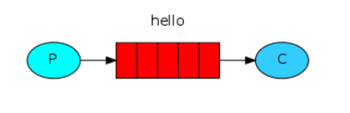
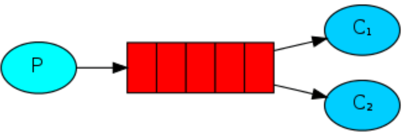
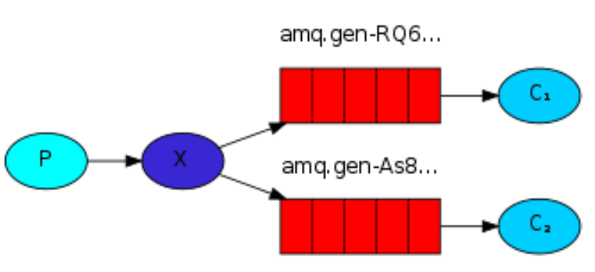

### 1 Hello World
    
这个其实是默认的交换机，我们需要提供一个生产者一个队列以及一个消费者。消息传播图如下：  
  
这个时候使用的其实是**默认的直连交换机（DirectExchange）**，DirectExchange 的路由策略是将消息队列绑定到一个 DirectExchange 上，当一条消息到达 DirectExchange 时会被转发到与该条消息 `routing key` 相同的 Queue 上，例如消息队列名为 “hello-queue”，则 routingkey 为 “hello-queue” 的消息会被该消息队列接收。  

### 2 work queue  
一个生产者，一个默认的交换机（DirectExchange），一个队列，两个消费者:  
  
一个队列对应了多个消费者，**默认情况下，由队列对消息进行平均分配，消息会被分到不同的消费者手中**。**消费者可以配置各自的并发能力，进而提高消息的消费能力，也可以配置手动 ack，来决定是否要消费某一条消息**。  

### 3 Publish/Subscribe 
**一个生产者，多个消费者，每一个消费者都有自己的一个队列，生产者没有将消息直接发送到队列，而是发送到了交换机，每个队列绑定交换机，生产者发送的消息经过交换机，到达队列，实现一个消息被多个消费者获取的目的**。需要注意的是，如果将消息发送到一个没有队列绑定的 Exchange上面，那么该消息将会丢失，这是因为在 RabbitMQ 中 Exchange 不具备存储消息的能力，只有队列具备存储消息的能力，如下图：

  

#### Direct Exchange

DirectExchange 的路由策略是将消息队列绑定到一个 DirectExchange 上，当一条消息到达 DirectExchange 时会被转发到与该条消息 routing key 相同的 Queue 上，例如消息队列名为 “hello-queue”，则 routingkey 为 “hello-queue” 的消息会被该消息队列接收。
#### Fanout Exchange

#### Topic Exchange

#### Header Exchange

### 4 Routing  
一个生产者，一个交换机，两个队列，两个消费者，生产者在创建 Exchange 后，根据 RoutingKey 去绑定相应的队列，并且在发送消息时，指定消息的具体 RoutingKey 即可。

### 5 Topics 

### 6 RPC 

### 7 Publisher Confirms 